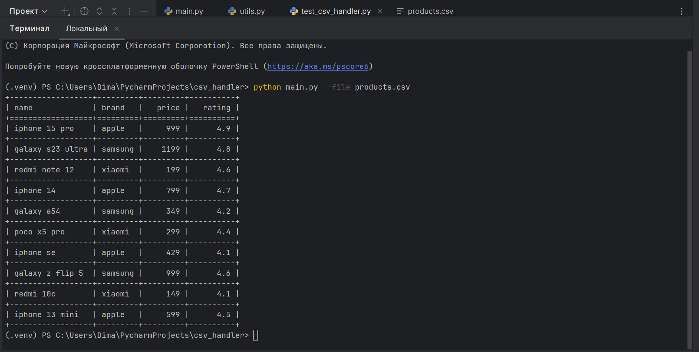
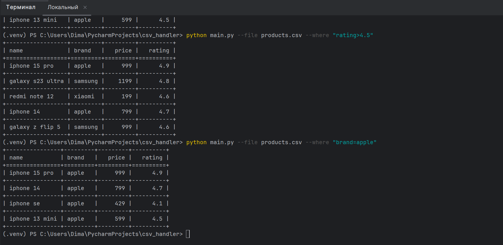
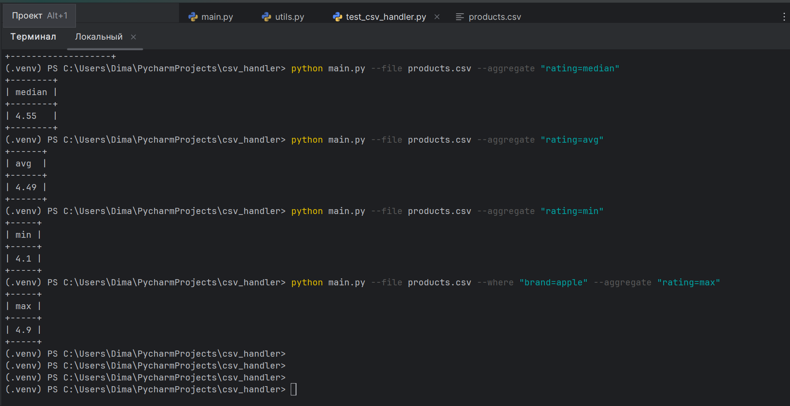
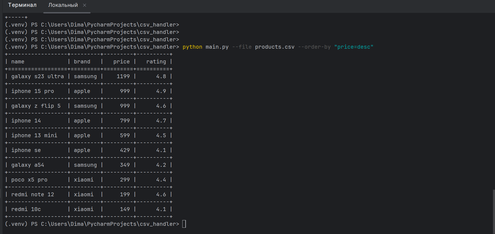
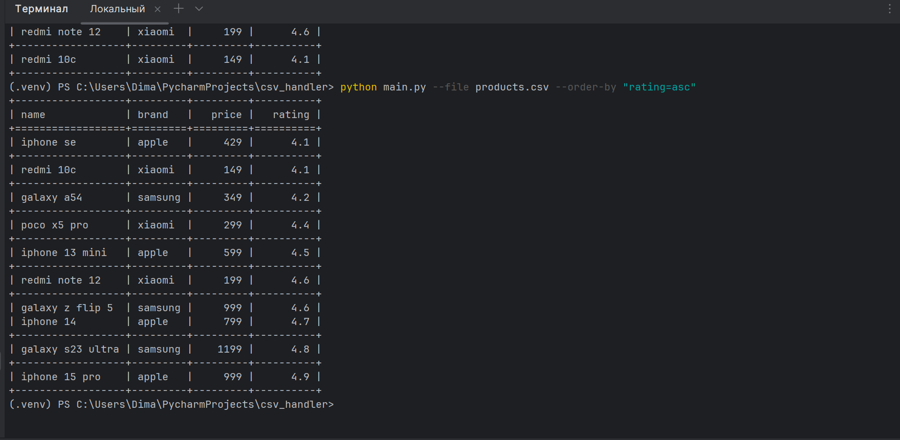
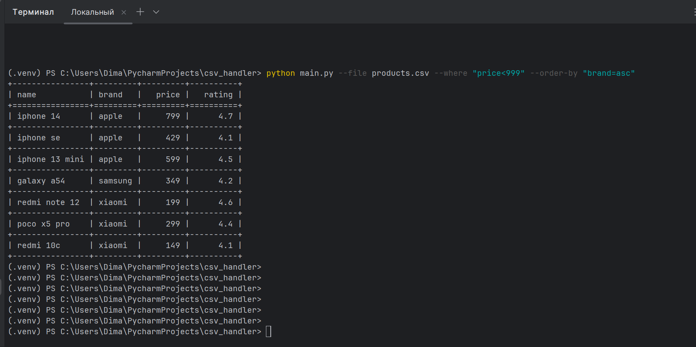

# ⚙ Пример работы скрипта

## Получить все данные

---

## Фильтрация

---

## Агрегация

---

## Сортировка
### Сортировка по убыванию price (desc)

### Сортировка по возрастанию rating (asc)

### Сортировка по возрастанию brand (asc) с фильтрацией данных
